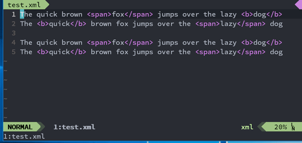

# JsReplace.vim



Vim plugin that allows you to use Javascript RegExp pattern replacement.

## Usage

```vimL
:%JsReplace pattern [replacement [flags]]
```

`flags` is used as a second argument of [RegExp constructor](https://developer.mozilla.org/en-US/docs/Web/JavaScript/Reference/Global_Objects/RegExp).
See also [Options](#options),

## Dependencies

- [Node.js](https://nodejs.org/)

## Install(Pathogen)

```vimL
git clone https://github.com/retorillo/jsreplace.vim.git ~/.vim/bundle/jsreplace.vim
```

## Options

When `flags` is not specified, `g:jsRreplace#defaultFlags` is used for RegExp
constructor. When Node.js command name is not 'node' on your system, set
`g:jsReplace#nodeCommand`.

```vimL
let g:jsReplace#defaultFlags = "g"
let g:jsReplace#nodeCommand = "nodejs"
```

## License

Distributed under the the MIT license

Copyright (C) 2016 Retorillo
